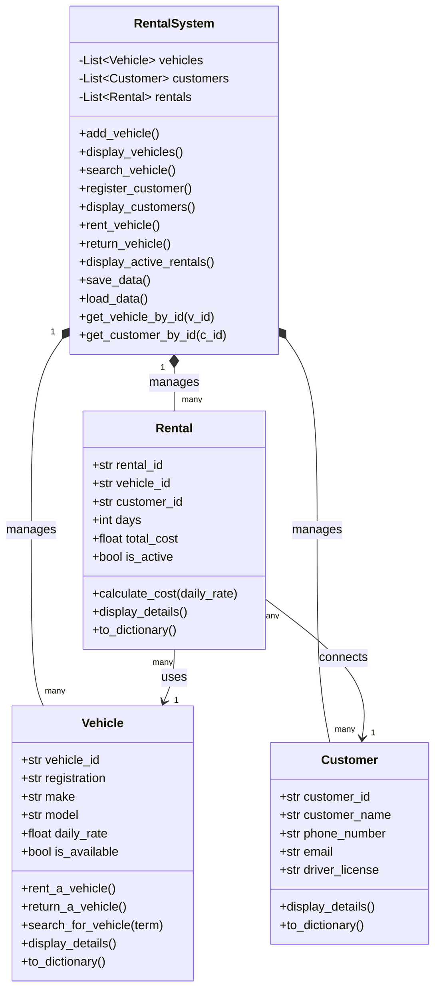

## How the classes work together

**RentalSystem** is the main part of the program. It manages the vehicles, customers, and rental records. It also has helper methods that allow the system to find a specific vehicle or customer using their ID.

**Vehicle** represents a single vehicle in the system. It stores information such as the vehicle ID, registration number, make, model, daily rental price, and whether the vehicle is available.

**Customer** represents a person who rents a vehicle. It stores the customer's ID, name, phone number, email, and driver's license information.

**Rental** represents a rental transaction. It connects a customer with a vehicle and records details such as the number of rental days, total cost, and whether the rental is still active.

In simple terms, **RentalSystem manages everything, Vehicle stores vehicle information, Customer stores customer information, and Rental connects a customer to a vehicle when a rental takes place.**

